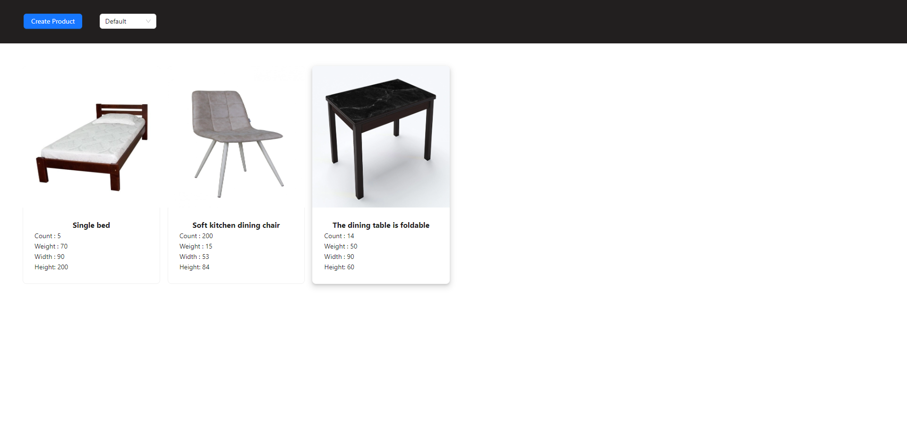
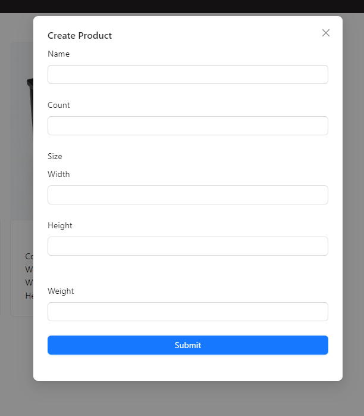
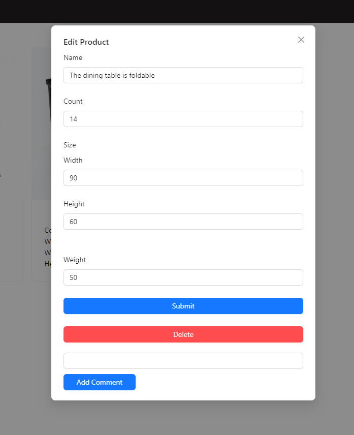
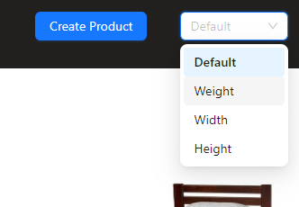

# Getting Started with Create React App

This project was bootstrapped with [Create React App](https://github.com/facebook/create-react-app).

## Available Scripts

In the project directory, you can run:

### `npm run start:dev`

Runs the app in the development mode.\
Open [http://localhost:3000](http://localhost:3000) to view it in the browser.

The page will reload if you make edits.\
You will also see any lint errors in the console.

### `npm run start-json-server`

Runs json-server for.

### `Photo`

   Home page.
  

  
  

    Create new product.
  

  
  

      Edit and comment product.
  

  
   

   Sort products.
  

  

